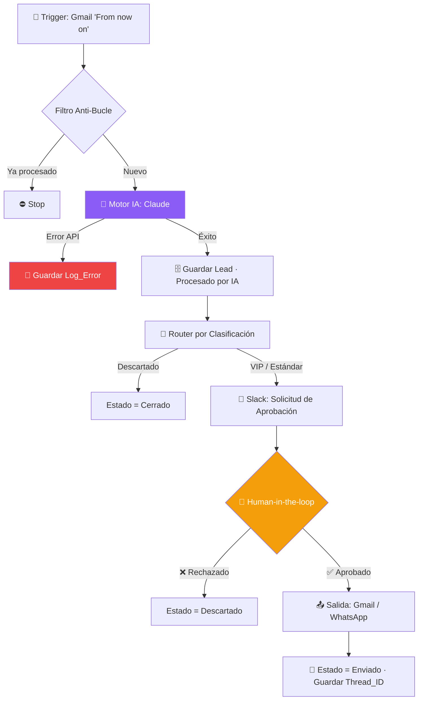

# 🤖 Ecosistema de Automatización IA — Clasificación y Respuesta de Leads VIP

---

## 📑 Tabla de Contenidos

- [Descripción General](#-descripción-general)
- [Arquitectura](#-arquitectura)
- [Stack Tecnológico](#-stack-tecnológico)
- [Estructura de la Base de Datos](#-estructura-de-la-base-de-datos)
- [Instalación y Configuración](#-instalación-y-configuración)
- [Prompt Dinámico de IA](#-prompt-dinámico-de-ia)
- [Human-in-the-loop](#-human-in-the-loop)
- [Pruebas y Evidencias](#-pruebas-y-evidencias)
- [Check de Seguridad](#-check-de-seguridad)
- [Enlaces Obligatorios](#-enlaces-obligatorios)
- [Estructura del Repositorio](#-estructura-del-repositorio)
- [Autor](#-autor)

---

## 🎯 Descripción General

Este proyecto resuelve la **gestión manual y lenta de leads comerciales**. Cuando llega un correo de un potencial cliente, el sistema:

1. **Detecta** el correo entrante mediante un trigger específico (evita consumo innecesario).
2. **Clasifica** el lead con IA (`VIP` / `Estándar` / `Descartado`) y asigna un score numérico.
3. **Extrae** datos clave (nombre, empresa, sector) y **redacta** una propuesta borrador.
4. **Almacena** todo en una base de datos relacional con estados de seguimiento.
5. **Pausa** el flujo y solicita aprobación humana vía Slack.
6. **Envía** la respuesta final solo tras el visto bueno humano.

**Caso de uso:** Agencia de servicios que recibe consultas comerciales por correo y necesita priorizar y responder rápido sin perder el control de calidad.

---

## 🏗️ Arquitectura




## 🛠️ Stack Tecnológico

| Componente | Herramienta | Rol |
|---|---|---|
| **Orquestación** | n8n | Motor lógico del flujo |
| **Motor de IA** | Claude (Anthropic) | Clasificación y redacción |
| **Base de Datos** | Airtable | Memoria del sistema |
| **Aprobación** | Slack | Human-in-the-loop |
| **Salida** | Gmail / WhatsApp API | Comunicación multicanal |

---

## 🗄️ Estructura de la Base de Datos

### Tabla `Leads`

| Campo | Tipo | Descripción |
|---|---|---|
| `Lead_ID` | Autonumber | Clave primaria |
| `Nombre_Cliente` | Text | Extraído por IA |
| `Email` | Email | Destinatario de la respuesta |
| `Mensaje_Original` | Long text | Cuerpo del correo |
| `Clasificacion` | Single select | `VIP` / `Estándar` / `Descartado` |
| `Score_IA` | Number | 0–100 (comparación numérica) |
| `Estado` | Single select | `Pendiente` → `Procesado por IA` → `Esperando Aprobación` → `Aprobado por Humano` → `Enviado` / `Error` |
| `Propuesta_Generada` | Long text | Borrador de IA |
| `Empresa` | Link → `Empresas` | 🔗 Relación |
| `Thread_ID_Slack` | Text | Mapeo de hilos |
| `Log_Error` | Long text | Registro de fallos de API |

### Tabla `Empresas`

| Campo | Tipo | Descripción |
|---|---|---|
| `Empresa_ID` | Autonumber | Clave primaria |
| `Nombre_Empresa` | Text | — |
| `Sector` | Single select | — |
| `Leads_Asociados` | Link → `Leads` | 🔗 Relación inversa |

> ⚠️ La **única fuente de escritura** es el flujo de automatización, para evitar conflictos de sincronización.

---

## ⚙️ Instalación y Configuración

### Requisitos previos

- Cuenta en [n8n](https://n8n.io) (cloud o self-hosted).
- API Key de [Anthropic (Claude)](https://console.anthropic.com).
- Base de datos configurada en [Airtable] https://airtable.com/invite/l?inviteId=inv8ELFMUbmX933j1&inviteToken=1f052fef7a93f0d4955d2ea375df8db0e23968fa089c1e82395f72b34c4e7d2c&utm_medium=email&utm_source=product_team&utm_content=transactional-alerts
  
- Workspace de Slack con app y webhook habilitados.

### Pasos

```bash
# 1. Clona el repositorio
git clone https://github.com/tu-usuario/ecosistema-ia-leads.git
cd ecosistema-ia-leads
```

```text
2. Importa el flujo en n8n:
   Menú → Import from File → selecciona `flujo.json`

3. Configura las credenciales (NUNCA las subas al repo):
   - Gmail OAuth2
   - Anthropic API Key
   - Airtable Personal Access Token
   - Slack OAuth2

4. Ajusta las variables de entorno en `.env`:
```


5. Activa el flujo y realiza una prueba de humo con un correo real.

> 🔐 El archivo `.env` está incluido en `.gitignore`. **Nunca** subas claves ni credenciales.

---

## 🧠 Prompt Dinámico de IA

El prompt usa variables del sistema (no texto estático) y fuerza salida en JSON:

```text
Eres un analista de ventas experto. Analiza el siguiente correo entrante.

DATOS DINÁMICOS:
- Remitente: {{ $json.from_name }}
- Asunto: {{ $json.subject }}
- Cuerpo: {{ $json.body }}

TAREAS:
1. Clasifica el lead como "VIP", "Estándar" o "Descartado".
2. Asigna un score numérico de 0 a 100.
3. Extrae: nombre_cliente, empresa, sector.
4. Redacta una propuesta breve y profesional (máx. 120 palabras).

Responde ÚNICAMENTE en JSON válido:
{ "clasificacion": "", "score": 0, "nombre_cliente": "", "empresa": "", "sector": "", "propuesta": "" }
```

**Optimización:** `Max Tokens: 500` · `Temperature: 0.3`.

---

## 🧑 Human-in-the-loop

Para evitar el "efecto metralleta", el flujo **se detiene** antes de contactar al cliente:

1. La IA genera la propuesta → estado `Esperando Aprobación`.
2. Se envía una notificación interactiva a Slack con botones **Aprobar / Rechazar**.
3. El nodo `Wait` congela la ejecución hasta recibir el webhook de respuesta.
4. Solo con la aprobación humana se dispara la salida multicanal.

---

## Pruebas y Evidencias

Se ejecutó el flujo **más de 5 veces**, incluyendo el *camino infeliz*.

| # | Escenario | Resultado esperado | Estado |
|---|---|---|---|
| 1 | Lead VIP con datos completos | Clasificación `VIP` + Slack | ✅ |
| 2 | Lead estándar | Clasificación `Estándar` + Slack | ✅ |
| 3 | Correo irrelevante / spam | Clasificación `Descartado` | ✅ |
| 4 | **Datos incompletos** (sin cuerpo) | Ruta de error / filtro activo | ✅ |
| 5 | **Fallo simulado de API de IA** | Estado `Error` + `Log_Error` guardado | ✅ |

---

## Check de Seguridad

| Verificación | Estado | Implementación |
|---|---|---|
| Filtro anti-bucle infinito | ✔️ | Nodo `IF` que valida etiqueta `PROCESSED` |
| Comparación de tipos correcta | ✔️ | `Score_IA` comparado como **número** |
| Prompt dinámico con variables | ✔️ | Usa `{{ $json.* }}` del sistema |
| Gestión de errores (resiliencia) | ✔️ | `continueOnFail` + nodo de log |
| Credenciales ocultas | ✔️ | `.env` en `.gitignore` |

---

## 💰 Estrategia de Optimización de Costos y Recursos

Para garantizar la viabilidad financiera del ecosistema y evitar el despilfarro de presupuesto en llamadas API redundantes, se diseñó una estrategia multi-modelo y multi-modalidad de procesamiento. Esto nos permite certificar un **ahorro mínimo del 50% presupuestario** en comparación con una arquitectura lineal indexada a un solo LLM de gama alta.

### 1. Matriz de Decisión Estratégica

| Tarea / Proceso | Naturaleza de la Tarea | Modelo Asignado | Modalidad de Ejecución | Justificación Técnica y Financiera |
| :--- | :--- | :--- | :--- | :--- |
| **Triage inicial y Clasificación** | Mecánica y repetitiva (Volumen alto) | **GPT-4o-mini** | Tiempo Real (Streaming) | Requiere latencia mínima y costo ultra bajo ($0.15 / M tokens de entrada) para descartar spam sin quemar presupuesto. |
| **Redacción de Propuestas VIP** | Compleja, lectura densa, matices comerciales | **Claude 3.5 Sonnet** | Tiempo Real (Síncrono) | Las capacidades de redacción persuasiva y el seguimiento estricto de directrices JSON estructuradas de Anthropic justifican el costo para leads calificados. |
| **Análisis de Métricas y Logs semanales** | Procesamiento masivo de datos históricos | **GPT-4o-mini / Claude (Batch API)** | **API de Lotes (Batch)** | Tareas no urgentes que se envían agrupadas. La API de lotes ofrece un **50% de descuento directo** sobre la tarifa estándar al procesarse en un marco de 24 horas. |

---

### 2. Cuadro Comparativo de Eficiencia Financiera

El siguiente análisis financiero demuestra cómo la arquitectura implementada mitiga los costos operativos fijos mensuales frente a un modelo tradicional no optimizado.

```json
{
  "analisis_costos_mensuales": {
    "escenario_tradicional_todo_sonnet": {
      "volumen_leads_mes": 10000,
      "costo_promedio_por_lead": "0.030 USD",
      "costo_total_estimado": "300.00 USD",
      "descripcion": "Procesar el 100% de los correos entrantes (incluyendo spam y descartados) directamente con modelos de alta densidad."
    },
    "escenario_optimizado_arquitectura_limpia": {
      "triage_gpt4o_mini_90_porciento": "1.35 USD (9,000 correos filtrados a precio mínimo)",
      "redaccion_claude_sonnet_10_porciento": "30.00 USD (1,000 leads VIP procesados con alta costura cognitiva)",
      "analisis_reportes_batch_api": "5.00 USD (Procesamiento asíncrono con 50% de descuento aplicado)",
      "costo_total_estimado": "36.35 USD",
      "ahorro_certificado": "87.8%"
    }
  }
}

```

##  Enlaces Obligatorios

- 🗄️ **Base de Datos (modo lectura):** `https://airtable.com/invite/l?inviteId=inv8ELFMUbmX933j1&inviteToken=1f052fef7a93f0d4955d2ea375df8db0e23968fa089c1e82395f72b34c4e7d2c&utm_medium=email&utm_source=product_team&utm_content=transactional-alerts`
- 🎬 **Video Demo (3 min):** `https://www.youtube.com/watch?v=Ph7o4mlH0cE`
- 📄 **Diagrama de Arquitectura (PDF):** [`arquitectura.pdf`](./Diagrama_Flujo_IA_Con_Imagen.pdf)
- 📦 **Blueprint del Flujo:** [`flujo.json`](./flujo.json)

---


## 👤 Autor

Joaquín Núñez 
📧 joaqui2908@hotmail.com · 🔗 [LinkedIn](https://www.linkedin.com/in/joaqu%C3%ADn-n%C3%BA%C3%B1ez-8a3338211/)

---
